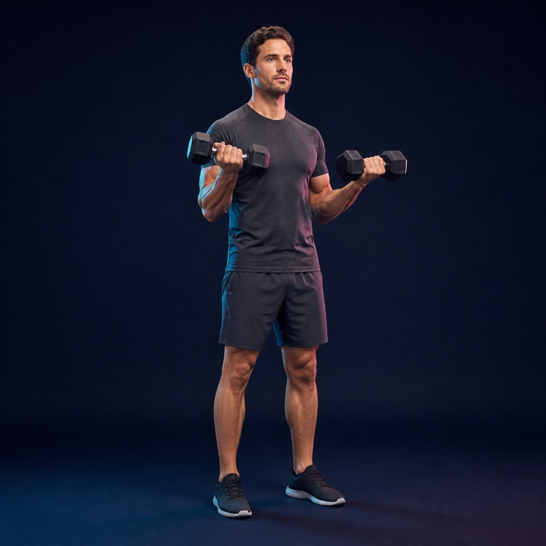
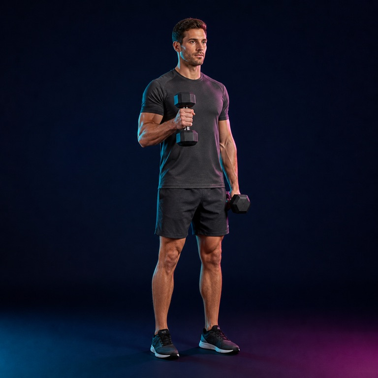
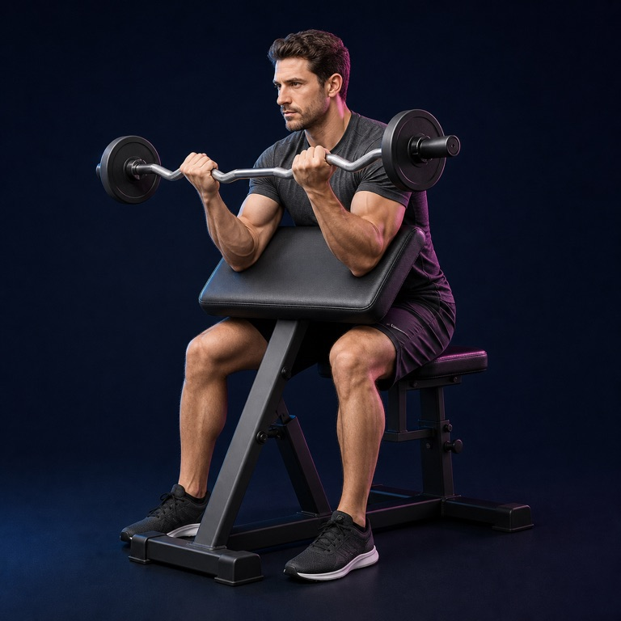
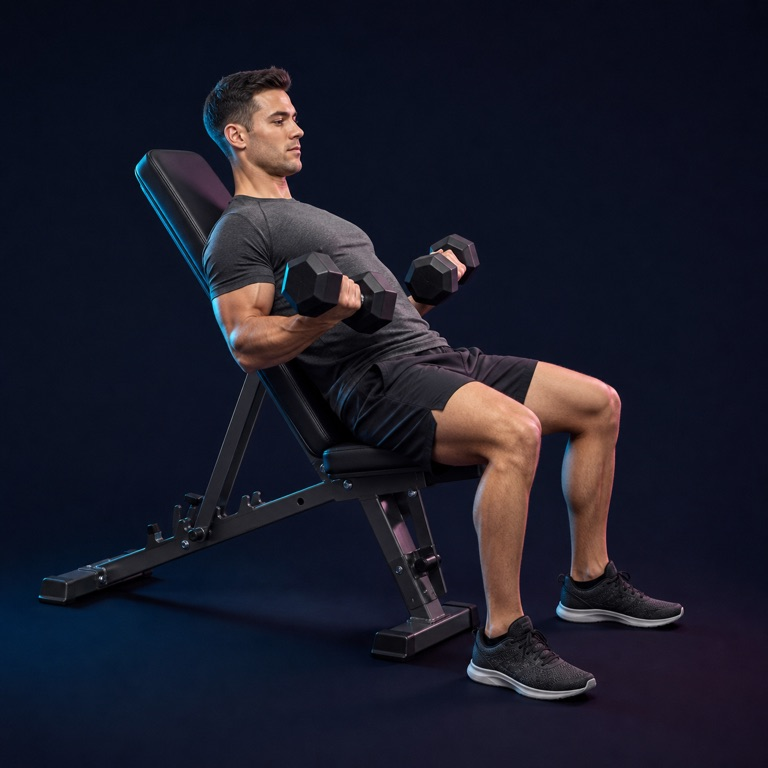
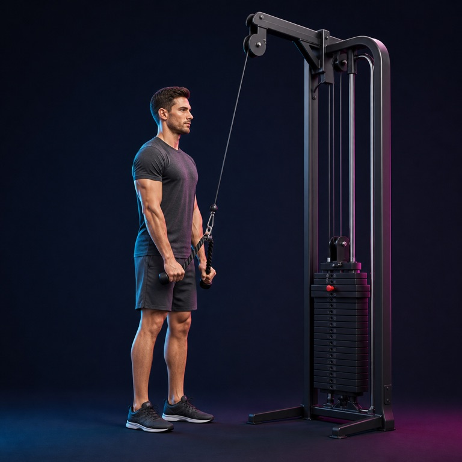
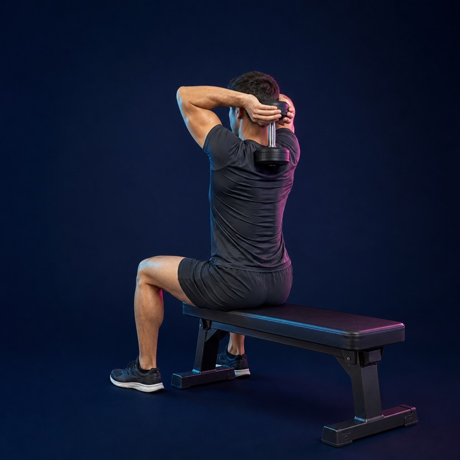
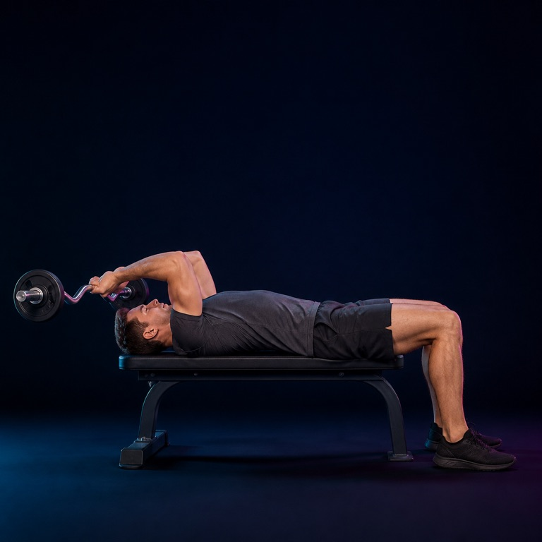
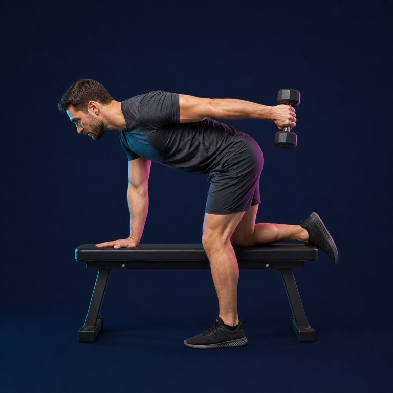
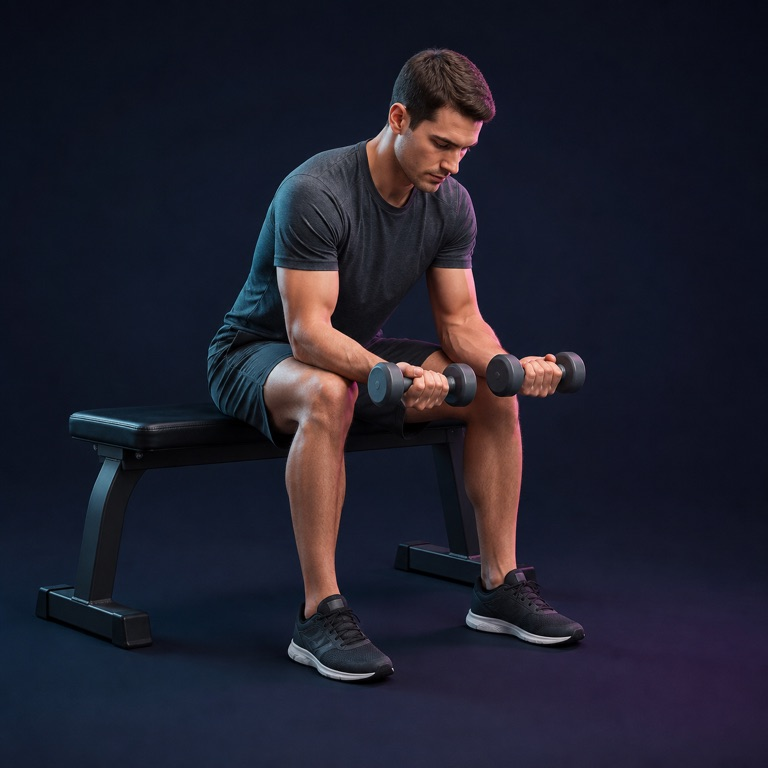
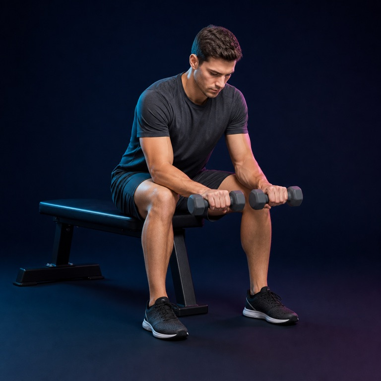

# Arms image library

10 AI-generated exercise illustrations matching the Liftr leg-day collection.

Use the JPEGs in `images/arms/` for the app. Original PNGs are here. Exact prompts are in [prompts.json](prompts.json); paths, equipment and review status are in `assets/manifest.json`. All images need qualified trainer review before use as technique guidance.

| Exercise | Preview | Equipment |
|---|---|---|
| Standing dumbbell curl |  | dumbbells |
| Hammer curl |  | dumbbells |
| Preacher curl |  | EZ curl bar and preacher bench |
| Incline dumbbell curl |  | dumbbells and incline bench |
| Rope triceps pushdown |  | high cable machine and rope handle |
| Overhead dumbbell triceps extension |  | single dumbbell |
| Lying EZ-bar triceps extension |  | EZ curl bar and flat bench |
| Dumbbell triceps kickback |  | dumbbell and bench |
| Seated wrist curl |  | dumbbells and bench |
| Seated reverse wrist curl |  | dumbbells and bench |
