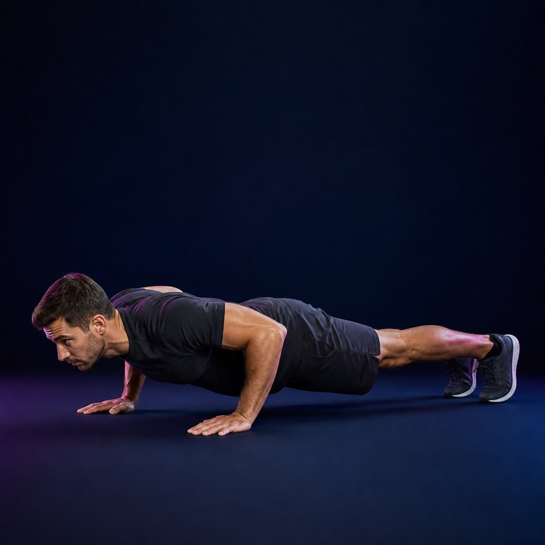
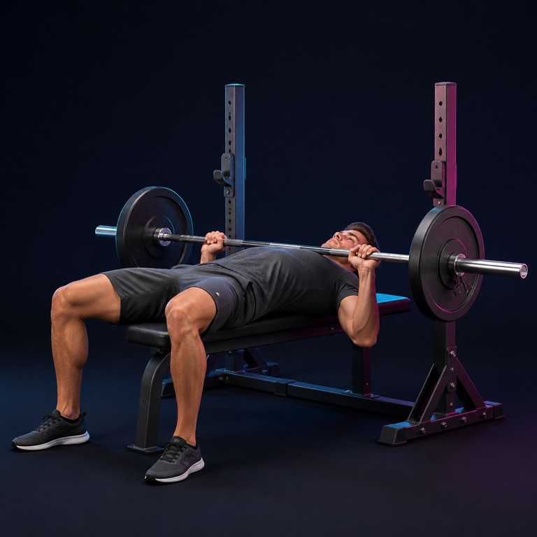
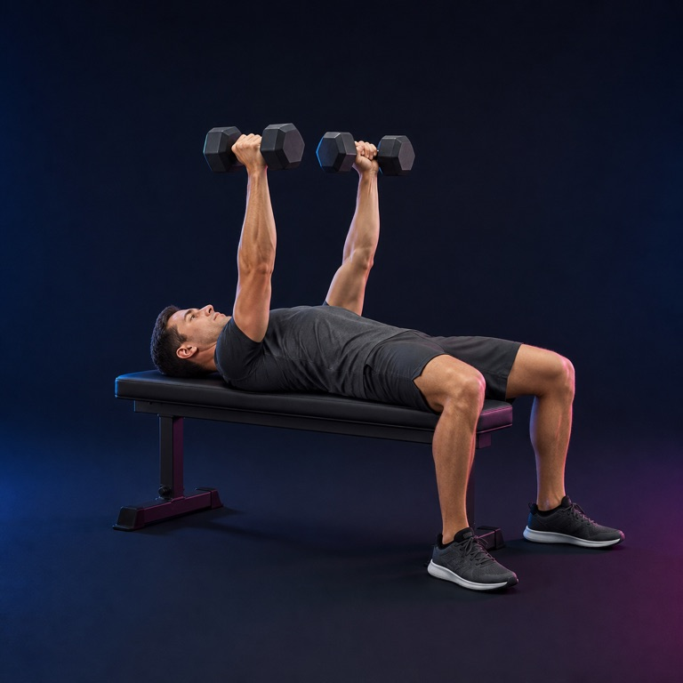
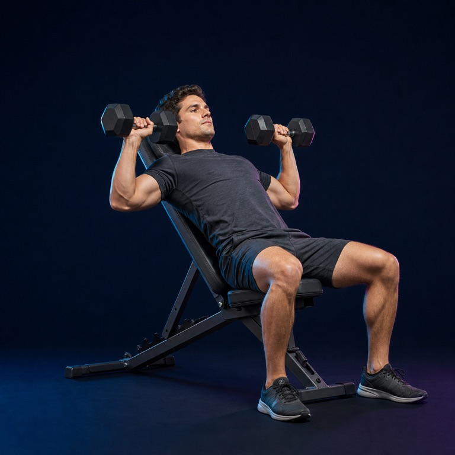
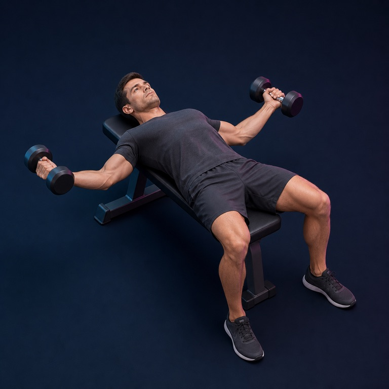
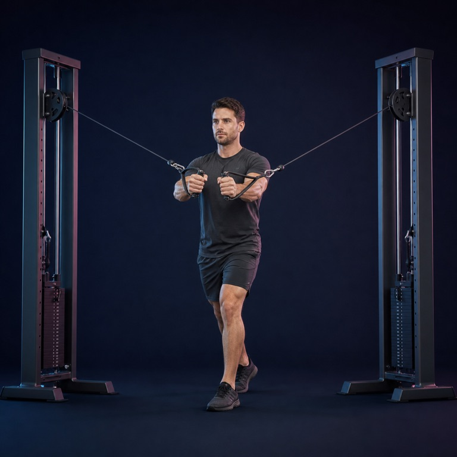
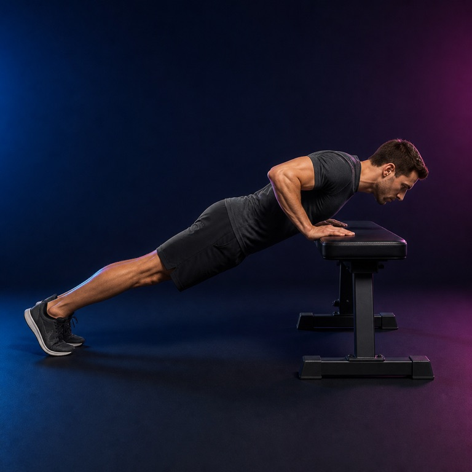
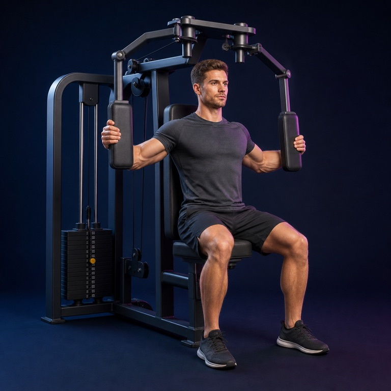

# Chest image library

8 AI-generated exercise illustrations matching the Liftr leg-day collection.

Use the JPEGs in `images/chest/` for the app. Original PNGs are here. Exact prompts are in [prompts.json](prompts.json); paths, equipment and review status are in `assets/manifest.json`. All images need qualified trainer review before use as technique guidance.

| Exercise | Preview | Equipment |
|---|---|---|
| Push-up |  | bodyweight |
| Barbell bench press |  | barbell and flat bench |
| Dumbbell bench press |  | dumbbells and flat bench |
| Incline dumbbell press |  | dumbbells and incline bench |
| Dumbbell chest fly |  | dumbbells and flat bench |
| Cable chest fly |  | dual cable machine |
| Incline push-up |  | stable bench |
| Pec deck fly |  | pec deck machine |
