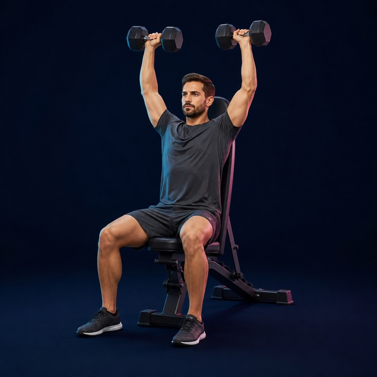
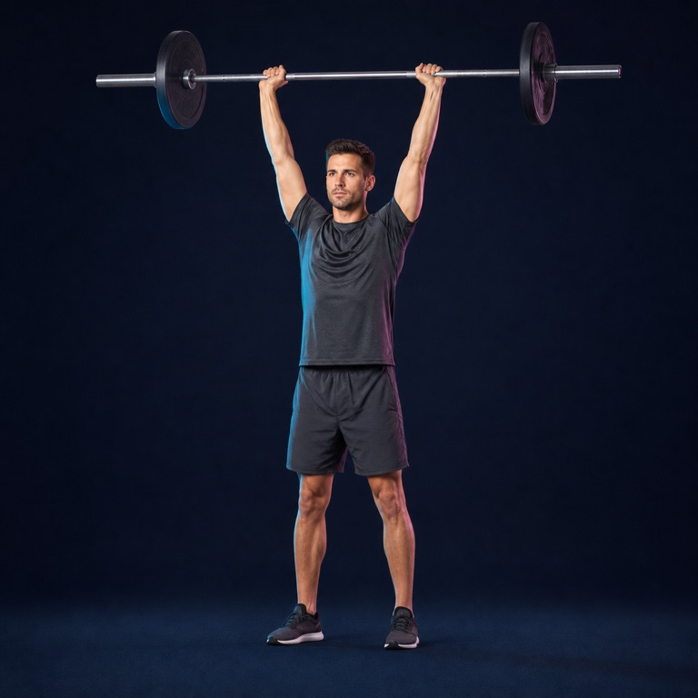
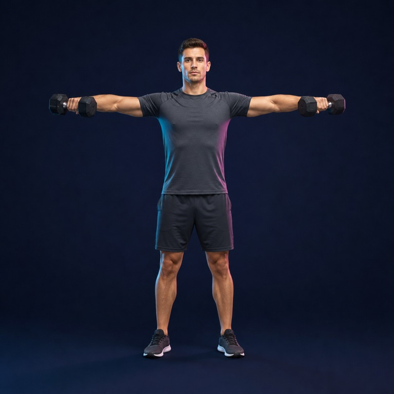
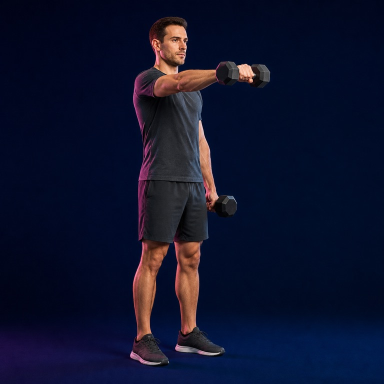
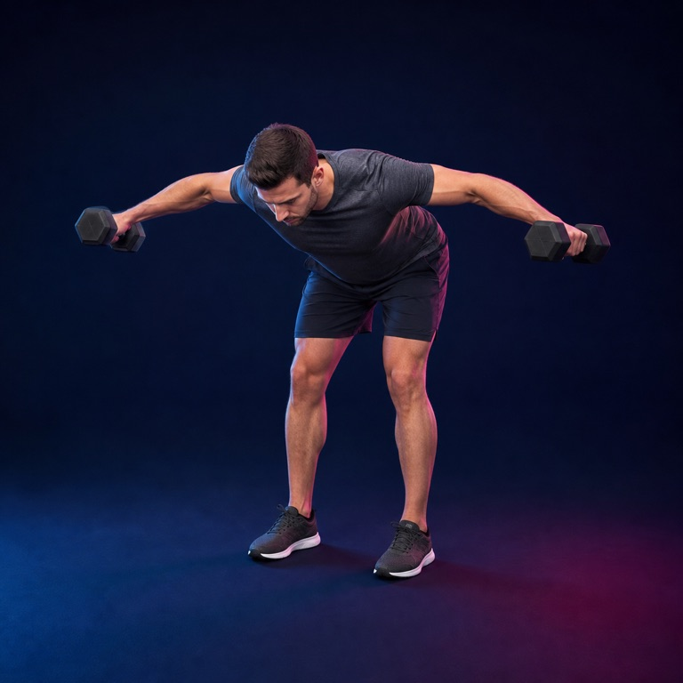
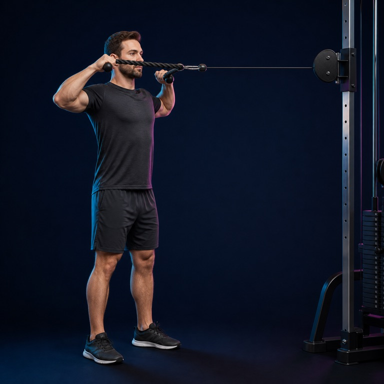
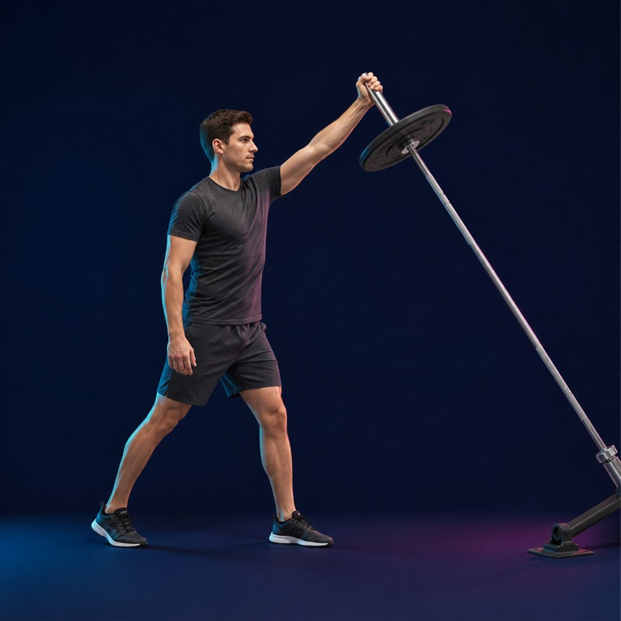
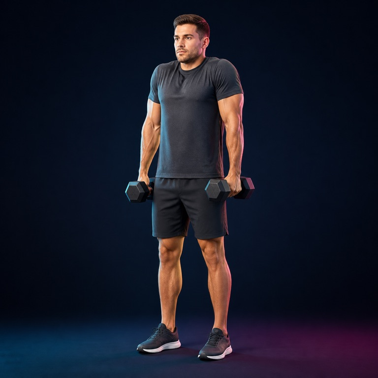

# Shoulders image library

8 AI-generated exercise illustrations matching the Liftr leg-day collection.

Use the JPEGs in `images/shoulders/` for the app. Original PNGs are here. Exact prompts are in [prompts.json](prompts.json); paths, equipment and review status are in `assets/manifest.json`. All images need qualified trainer review before use as technique guidance.

| Exercise | Preview | Equipment |
|---|---|---|
| Seated dumbbell shoulder press |  | dumbbells and upright bench |
| Standing barbell overhead press |  | barbell |
| Dumbbell lateral raise |  | dumbbells |
| Dumbbell front raise |  | dumbbells |
| Bent-over reverse fly |  | dumbbells |
| Cable face pull |  | cable machine and rope handle |
| Single-arm landmine press |  | landmine barbell |
| Dumbbell shrug |  | dumbbells |
