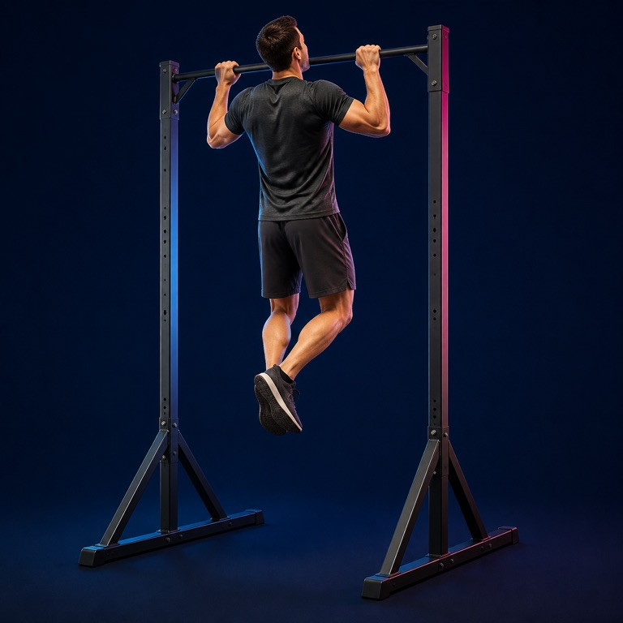
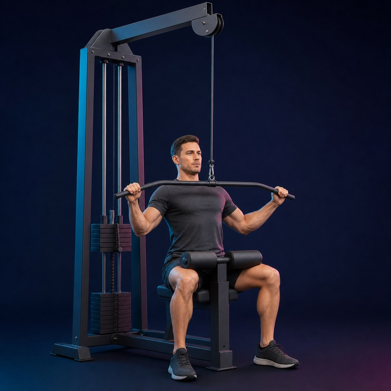
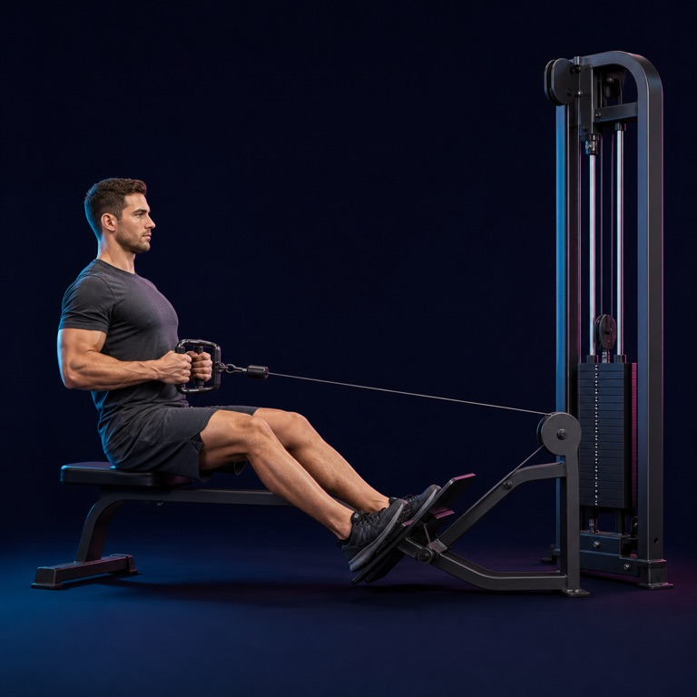
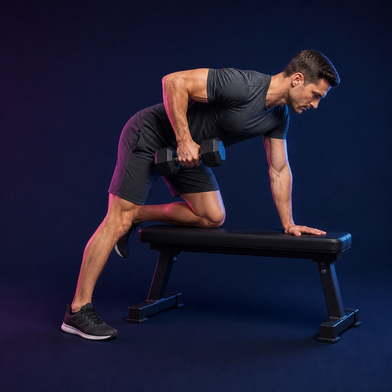
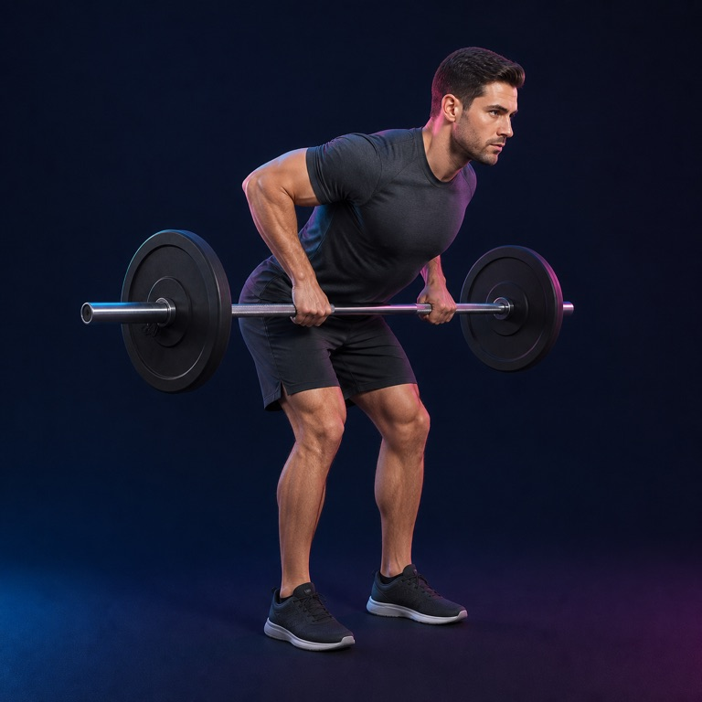
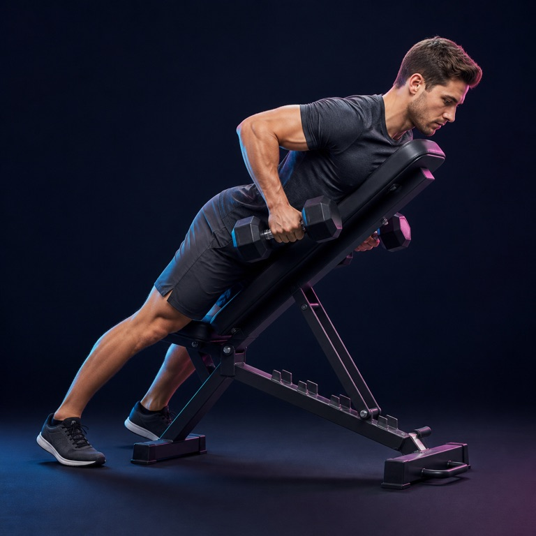
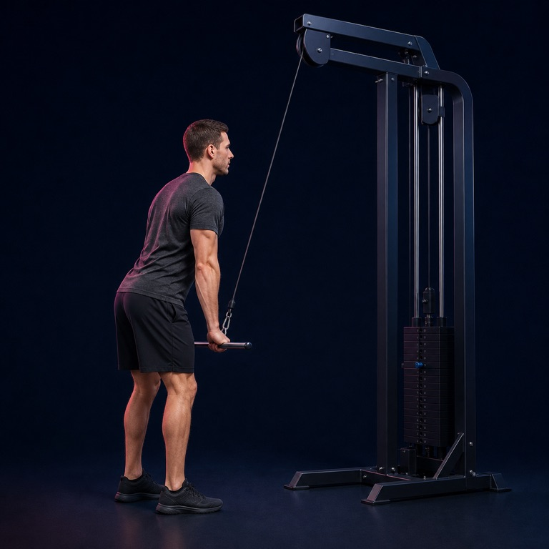
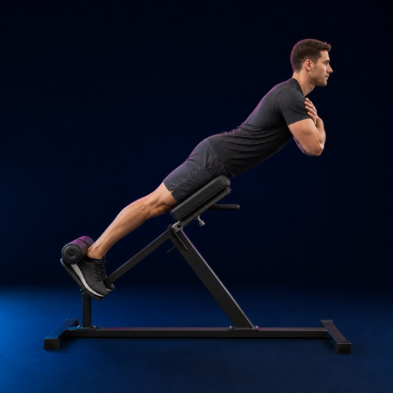

# Back image library

8 AI-generated exercise illustrations matching the Liftr leg-day collection.

Use the JPEGs in `images/back/` for the app. Original PNGs are in `assets/images/back/`. Exact prompts are in [prompts.json](../../assets/images/back/prompts.json); paths, equipment and review status are in `assets/manifest.json`. All images need qualified trainer review before use as technique guidance.

| Exercise | Preview | Equipment |
|---|---|---|
| Pull-up |  | pull-up bar |
| Lat pulldown |  | lat pulldown machine |
| Seated cable row |  | low cable row machine |
| One-arm dumbbell row |  | dumbbell and bench |
| Bent-over barbell row |  | barbell |
| Chest-supported dumbbell row |  | dumbbells and incline bench |
| Straight-arm cable pulldown |  | high cable machine |
| Back extension |  | 45-degree Roman chair |
